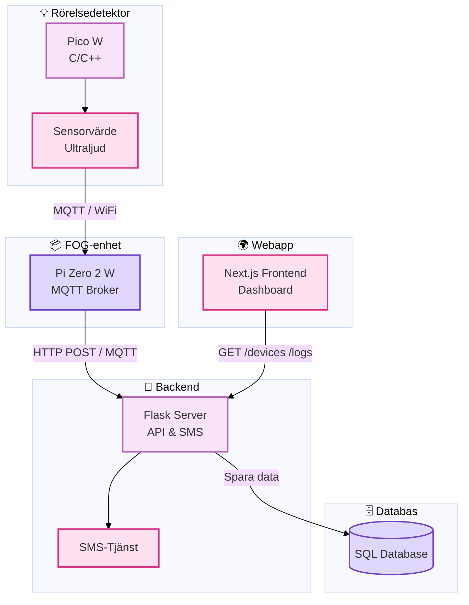

# 🔐 Hemlarmssystem – IoT-baserad lösning med realtidsövervakning

Ett komplett IoT-baserat hemlarmssystem som använder MQTT, Flask, ultraljudssensor och webbaserad övervakning. Systemet upptäcker rörelse, larmar, och skickar realtidsdata till en webapp via MQTT och REST API.

---

## 🧱 Tech Stack

| Lager             | Teknik                                       |
|-------------------|----------------------------------------------|
| ✅ Frontend       | **React** (Next.js)                           |
| ✅ Backend        | **Python (Flask)** – API, logik och SMS      |
| ✅ Mikrokontroller | **C/C++** – Raspberry Pi Pico W               |
| ✅ Fog-enhet      | **C** – Raspberry Pi Zero 2 W med MQTT Broker |
| ✅ Databas        | **SQLite**                                    |

---

## 🗺️ Systemöversikt

---
## 📌 Projektets komponenter

| Komponent           | Beskrivning                                                                                     |
|---------------------|-------------------------------------------------------------------------------------------------|
| 💡 Rörelsedetektor  | Raspberry Pi Pico W som samlar in data från ultraljudssensor och skickar via MQTT. Firmware i C/C++. |
| 📦 Fog-enhet        | Raspberry Pi Zero 2 W som kör MQTT Broker och vidarebefordrar data till backend via HTTP/MQTT.  |
| 🧠 Backend          | Python Flask API som tar emot data, hanterar logik, sparar i SQLite och skickar SMS-larm.       |
| 🗄️ Databas         | SQLite lagrar sensorloggar och larmhistorik.                                                   |
| 🌍 Webapp           | React/Next.js-dashboard som visar realtidsdata och historik via REST API.                      |

---
